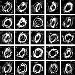
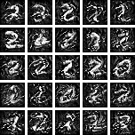
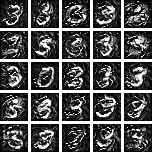
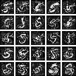
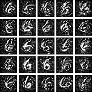
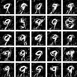

# Extracting Robust Features From MNIST

## TODOs:
- [x] Implement robust training

- [x] Implement a sufficient amount of perturbation

- [x] Compare performance of std model and robust model

- [ ] Implement gradient descent for reconstructing features

## Current Problems

- [x] Convergence: the robust model does not seem to converge well (may need to pretrain the model first)

- [ ] Why does horizontal lines hurt accuracy more significantly than vertical lines?

## Goals

- [ ] Is it possible to synthesize "robust" features directly?
- [ ] Is it possible to differentiate nonrobust and robust features blindly?
- [ ] Is is possible to create perturbation that leads to human-readable robust features?

## The dataset

The MNIST datset is available at <http://yann.lecun.com/exdb/mnist/>.

If you would like to run this script on your computer, go to `/dataset` folder and uncompress all the dataset files to that folder.

## Test results

The perturbated image samples can be seen in figure below. The last column is ground truth. The group IDs correspond to the order
of images in the figure.

| Group Id | Std Accuracy | Robust Accuracy|
|:---:|:---:|:---:|
|1| 0.829 | 0.968 |
|2| 0.549 | 0.967 |
|3| 0.808 | 0.969 |
|4| 0.727 | 0.950 |
|5| 0.977 | 0.972 |

## Reconstruction

|Original|Reconstruction (Robust)|Reconstruction (Nonrobust)|
|:---:|:---:|:---:|
||||
||||
||||
||||
||||
||||
||||
||||
||||
||||

## File description:
- `perturbation.py`: creates and manages perturbations
- `load_mnist.py`: loading data from MNIST idx format (need to correct endianess if the data format has sizes greater than 1 byte)
- `train_std_model.py`: trains standard model
- `train_pretrained_model`: trains a pretrain model as initial weights for robust model
- `train_robust_model.py`: trains the robust model
- `test_std_model`: tests the performance of std model on adversarial dataset
- `test_robust_model`: tests the performance of robust model on adversarial dataset

## References

- Ilyas, Andrew, et al. "Adversarial examples are not bugs, they are features." *arXiv preprint arXiv:1905.02175* (2019).

